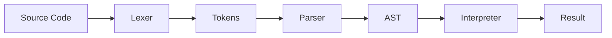
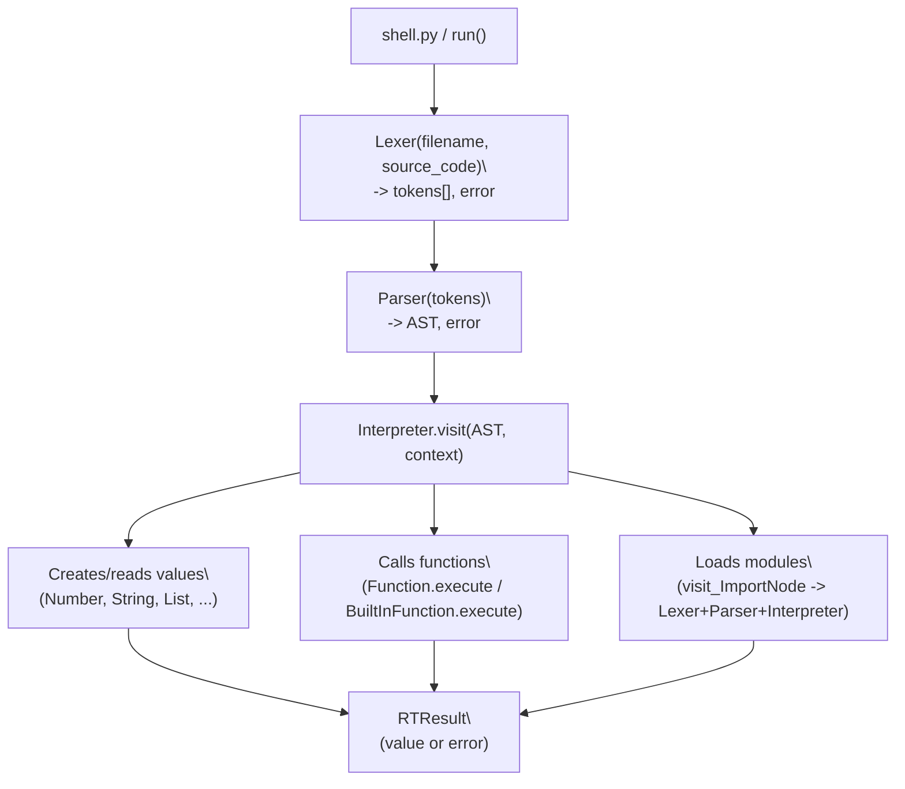

# OmiLang Architecture

> Interpreter design and project structure

---

## Navigation

- [Documentation](Documentation.md) - syntax, types, functions, imports
- [Modules](Modules.md) - built-in modules (`system`, `files`, `paths`, `time`, `math`)
- [Architecture (this page)](Architecture.md) - project structure and interpreter internals

---

## Contents

- [How the Interpreter Works](#how-the-interpreter-works)
- [Execution Stages](#execution-stages)
  - [1. Lexer](#1-lexer)
  - [2. Parser](#2-parser)
  - [3. Interpreter](#3-interpreter)
- [Project Structure](#project-structure)
- [Directory Overview](#directory-overview)
  - [src/main/](#srcmain)
  - [src/nodes/](#srcnodes)
  - [src/values/](#srcvalues)
  - [src/error/](#srcerror)
  - [src/run/](#srcrun)
  - [src/stdlib/](#srcstdlib)
  - [src/var/](#srcvar)
- [Data Flow](#data-flow)

---

## How the Interpreter Works

OmiLang is an interpreted language. Source code is not compiled to machine code or bytecode; it is processed directly in three stages:



---

## Execution Stages

### 1. Lexer

**File:** `src/main/lexer.py`

The lexer splits source text into **tokens** - the smallest meaningful language units.

Example: `var x = 10 + 5` becomes:

```
[KEYWORD:var] [IDENTIFIER:x] [EQ] [INT:10] [PLUS] [INT:5] [EOF]
```

Token types are defined in `src/var/token.py`:
- `TT_INT`, `TT_FLOAT` - numbers
- `TT_STRING` - strings
- `TT_IDENTIFIER` - variable/function names
- `TT_KEYWORD` - keywords (`var`, `func`, `if`, `for`, ...)
- `TT_PLUS`, `TT_MINUS`, `TT_MUL`, `TT_DIV`, `TT_POW` - arithmetic
- `TT_EQ`, `TT_EE`, `TT_NE`, `TT_LT`, `TT_GT`, `TT_LTE`, `TT_GTE` - comparisons
- `TT_LPAREN`, `TT_RPAREN`, `TT_LSQUARE`, `TT_RSQUARE` - brackets
- `TT_COMMA`, `TT_COLON`, `TT_ARROW`, `TT_DOT`, `TT_AT` - separators
- `TT_NEWLINE`, `TT_E0F` - control tokens

Keywords (`src/var/keyword.py`):
```
var, and, or, not, if, elif, else, for, to, step,
while, func, end, return, continue, break, import, as
```

### 2. Parser

**File:** `src/main/parser/parser.py`

The parser builds an **Abstract Syntax Tree (AST)** from the token stream using recursive descent parsing.

Precedence hierarchy (lowest to highest):

| Level | Method | Parses |
|---------|-------|------------|
| 1 | `expr()` | `var x = ...`, logical `and` / `or` |
| 2 | `comp_expr()` | Comparisons `==`, `!=`, `<`, `>`, `<=`, `>=`, `not` |
| 3 | `arith_expr()` | `+`, `-` |
| 4 | `term()` | `*`, `/` |
| 5 | `factor()` | Unary `+`, `-` |
| 6 | `power()` | `^` |
| 7 | `call()` | Calls `f()`, dotted access `m.x` |
| 8 | `atom()` | Numbers, strings, identifiers, `(...)`, `[...]`, `if`, `for`, `while`, `func` |

AST node classes are in `src/nodes/`:

| Node | Description |
|------|----------|
| `NumberNode` | Numeric literal |
| `StringNode` | String literal |
| `ListNode` | List `[...]` |
| `BinOpNode` | Binary operation `a + b` |
| `UnaryOpNode` | Unary operation `-x` |
| `VarAccessNode` | Variable access |
| `VarAssignNode` | Variable assignment |
| `IfNode` | `if/elif/else` block |
| `ForNode` | `for` loop |
| `WhileNode` | `while` loop |
| `FuncDefNode` | Function definition |
| `CallNode` | Function call |
| `ReturnNode` | `return` |
| `BreakNode` | `break` |
| `ContinueNode` | `continue` |
| `ImportNode` | `@import "..." as ...` |
| `ModuleAccessNode` | Dotted access `module.member` |

### 3. Interpreter

**File:** `src/main/interpret.py`

The interpreter walks the AST and executes each node. For each node type there is a `visit_*` method:

- `visit_NumberNode` -> creates `Number`
- `visit_BinOpNode` -> evaluates left and right side and applies operator
- `visit_CallNode` -> calls function with arguments
- `visit_ImportNode` -> loads a module (built-in or file)
- and so on

Runtime values are represented by classes in `src/values/`:

| Class | Description |
|-------|----------|
| `Number` | Numbers (`int`, `float`) |
| `String` | Strings |
| `List` | Lists |
| `Function` | User-defined functions |
| `BuiltInFunction` | Built-in functions (`print`, `input`, ...) |
| `Module` | Imported module (file or built-in) |

---

## Project Structure

```
Omi/
|-- shell.py                    # Entry point - interactive shell
|-- example.omi                 # Example: factorial
|
|-- src/
|   |-- main/
|   |   |-- lexer.py            # Lexical analyzer
|   |   |-- interpret.py        # Interpreter (AST visitor)
|   |   |-- symboltable.py      # Symbol table (variables)
|   |   \-- parser/
|   |       |-- parser.py       # Syntax analyzer
|   |       \-- result.py       # ParseResult
|   |
|   |-- nodes/                  # AST nodes
|   |   |-- types/              #   literals: number, string, list
|   |   |-- ops/                #   operations: binop, unaryop
|   |   |-- variables/          #   variables: access, assign
|   |   |-- condition/          #   conditions: if
|   |   |-- loops/              #   loops: for, while
|   |   |-- function/           #   functions: funcdef, call
|   |   |-- jump/               #   flow: return, break, continue
|   |   \-- imports/            #   imports: importN, moduleaccess
|   |
|   |-- values/                 # Runtime values
|   |   |-- value.py            # Base Value class
|   |   |-- types/              #   number, string, list, module
|   |   \-- function/           #   base, function, buildin
|   |
|   |-- error/                  # Error system
|   |   |-- error.py            # Base Error class
|   |   \-- message/            #   error types
|   |
|   |-- run/                    # Execution and context
|   |   |-- run.py              # run() function - main pipeline
|   |   |-- runtime.py          # RTResult
|   |   \-- context.py          # Context
|   |
|   |-- stdlib/                 # Standard library modules
|   |   |-- system.py
|   |   |-- files.py
|   |   |-- paths.py
|   |   |-- time.py
|   |   \-- math.py
|   |
|   |-- var/                    # Constants and definitions
|   |   |-- token.py            # Token type definitions
|   |   |-- keyword.py          # Keywords and supported file extensions
|   |   \-- constant.py         # Character sets
|   |
|   |-- tokens.py               # Token class
|   |-- position.py             # Position class
|   \-- arrow.py                # Error arrow helper
|
\-- docs/
    |-- Documentation.md        # Full language documentation
    |-- Modules.md              # Built-in modules reference
    \-- Architecture.md         # This file
```

---

## Directory Overview

### src/main/

Interpreter core: lexer, parser, and interpreter. The symbol table in `symboltable.py` stores and resolves variables, with nested scope support through `parent`.

### src/nodes/

AST node classes. Every node keeps source positions (`pos_start`, `pos_end`) for precise error messages. Nodes are grouped by domain: data types, operations, variables, conditions, loops, functions, flow control, imports.

### src/values/

Runtime value representations. Base class `Value` defines arithmetic and logical operation interfaces. Each concrete type (`Number`, `String`, `List`, `Module`) implements its own behavior. Functions (`Function`, `BuiltInFunction`) are also first-class values.

### src/error/

Error system. Base class `Error` formats messages with filename, line, and source arrow indicator. Error kinds:
- `IllegalCharError` - unknown character in lexer
- `ExpectedCharError` - specific character expected
- `InvalidSyntaxError` - parser syntax error
- `RTError` - runtime error (division by zero, undefined variable, ...)

### src/run/

Execution orchestration. `run.py` wires all stages: lexer -> parser -> interpreter. It creates the global symbol table with constants and built-ins. `RTResult` tracks values, errors, and control signals (`return`, `break`, `continue`).

### src/stdlib/

Standard library modules imported via `@import`. Each module creates a `Module` object with its own symbol table and functions.

| Module | Description |
|--------|----------|
| `system` | OS interaction: commands, environment variables, platform, exit |
| `files` | File system: mkdir, rm, rmdir, cp, mv, list |
| `paths` | Path helpers: join, abs, exists, ext, name |
| `time` | Time: now, format, parse, sleep, timezone |
| `math` | Math: constants (`pi`, `e`, `inf`), functions, random |

### src/var/

Definitions and constants: token types, keywords, and character sets (`DIGITS`, `LETTERS`, `LETTERS_DIGITS`).

---

## Data Flow



When importing a module with `@import`, the interpreter checks built-in modules first (`BUILTIN_MODULES`), then searches for a file on disk. For file modules, the full pipeline (lexer -> parser -> interpreter) runs again in a separate context. The resulting module symbol table is wrapped into a `Module` object.
